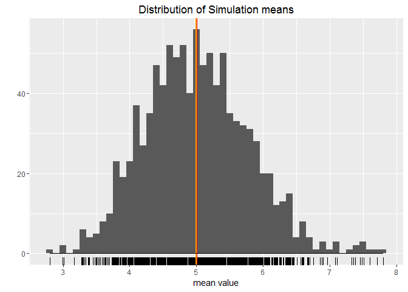
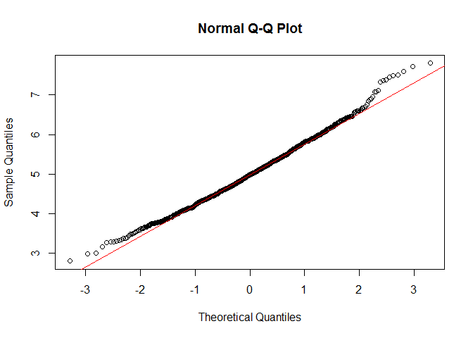

# Stat-Inference Course Project A - Simulation Exercise
Steven  


## 1 - Synopsis

In this analysis, we are going to investigate exponential distribution in R and compare it with the Central Limit Theorem. First, we will simulate 1,000 numbers for each of 40 exponentials, 40,000 numbers in total. Then, we will analysis their mean and variance, and compare it with other common distributions.

## 2 - Simulations

In particular, we use 7 as seed and 0.2 as lambda, generate 40,000 numbers and put them in a 40 * 1000 matrix.


```r
set.seed(56)
groups <- 1000
n <- 40
lambda <- 0.2
exp.mat <- matrix(data = rexp(groups * n, rate = lambda), nrow = groups)
```

## 3 - Analysis

Now, we will analysis these data from means, variances and general distributions.

### 3.1 - Sample Mean versus Theoretical Mean


```r
exp.means <- apply(exp.mat, 1, mean)
exp.means.mean <- mean(exp.means)
```

As we use **0.2** as $\lambda$, the mean of this distribution should be $1/\lambda$, which is **5**. In our simulation, the mean of simulations is **5.0094315**, fairly close to the theoretical value.

### 3.2 - Sample Variance versus Theoretical Variance


```r
exp.means.var <- sd(exp.means) ^ 2
exp.means.var.theory <- (1 / lambda) ^ 2 / n
```

The variance of simulations which is **0.6090837**, and the theoretical variance is **0.625** calculated by the formula $\frac{(1/\lambda)^2}{n}$. We can see that they are fairly close.
 
### 3.3 - Distribution

The distribution of means is as followed:


```r
ggplot(data.frame(exp.means), aes(exp.means)) + geom_histogram(binwidth = 0.1) + geom_rug() + geom_vline(xintercept = mean(exp.means), size = 1, col = "red") + geom_vline(xintercept = 1 / lambda, size = 1, col = "orange") + stat_function(fun = dnorm, args = list(mean = 5, sd = 5)) + labs(title = "Distribution of Simulation means", x = "mean value", y = "")
```

<!-- -->

We can see from the diagram that the distribution may be approximately normal. To make sure, we will perform a Shapiro-Wilk normality test on the means.


```r
shapiro.test(exp.means)
```

```
## 
## 	Shapiro-Wilk normality test
## 
## data:  exp.means
## W = 0.99326, p-value = 0.0001682
```

From the test, the distribution is not normal enough. To make further analysis, we draw a *qqnorm* plot to do double check. 


```r
qqnorm(exp.means)
qqline(exp.means, col = 2)
```

<!-- -->

The result seems fine. It's really hard to judge the distribution's normaliblity. So many factor would effect the result. We have to choose our standerd.

## 4 - Summary

This analysis is under the guidance of statistical inference course on Coursera. 


```r
sessionInfo()
```

```
## R version 3.2.5 (2016-04-14)
## Platform: x86_64-w64-mingw32/x64 (64-bit)
## Running under: Windows 10 x64 (build 10586)
## 
## locale:
## [1] LC_COLLATE=Chinese (Simplified)_China.936 
## [2] LC_CTYPE=Chinese (Simplified)_China.936   
## [3] LC_MONETARY=Chinese (Simplified)_China.936
## [4] LC_NUMERIC=C                              
## [5] LC_TIME=Chinese (Simplified)_China.936    
## 
## attached base packages:
## [1] stats     graphics  grDevices utils     datasets  methods   base     
## 
## other attached packages:
## [1] ggplot2_2.1.0
## 
## loaded via a namespace (and not attached):
##  [1] Rcpp_0.12.7      digest_0.6.10    plyr_1.8.4       grid_3.2.5      
##  [5] gtable_0.2.0     formatR_1.4      magrittr_1.5     evaluate_0.9    
##  [9] scales_0.4.0     stringi_1.1.2    rmarkdown_1.0    labeling_0.3    
## [13] tools_3.2.5      stringr_1.1.0    munsell_0.4.3    yaml_2.1.13     
## [17] colorspace_1.2-6 htmltools_0.3.5  knitr_1.14
```
