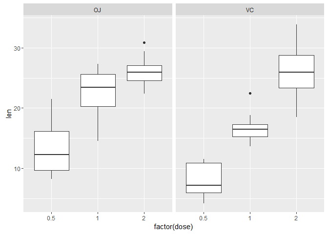

# Stat-Inference Course Project B - Tooth Growth
Steven  


## 1 - Synopsis

In this analysis, we're going to analyze the ToothGrowth data in the R datasets package, summarise the data and sse confidence intervals and hypothesis tests to compare tooth growth by supp and dose.

## 2 - Data Summarization


```r
str(ToothGrowth)
```

```
## 'data.frame':	60 obs. of  3 variables:
##  $ len : num  4.2 11.5 7.3 5.8 6.4 10 11.2 11.2 5.2 7 ...
##  $ supp: Factor w/ 2 levels "OJ","VC": 2 2 2 2 2 2 2 2 2 2 ...
##  $ dose: num  0.5 0.5 0.5 0.5 0.5 0.5 0.5 0.5 0.5 0.5 ...
```

```r
head(ToothGrowth)
```

```
##    len supp dose
## 1  4.2   VC  0.5
## 2 11.5   VC  0.5
## 3  7.3   VC  0.5
## 4  5.8   VC  0.5
## 5  6.4   VC  0.5
## 6 10.0   VC  0.5
```

The dose column is num type now, we will treat it as a factor kind variable. Let's have a look at their distribution.


```r
g <- ggplot(ToothGrowth, aes(factor(dose), len))
g + geom_boxplot() + facet_grid(. ~ supp)
```

<!-- -->

## 3 - Hypothesis Test

Now we are going to compare tooth growth by supply and dose. There is 3 kind of dose and 2 kind of supply. From the above analysis, the average len value of OJ may be larger than VC's. So we make the following hypothesis (with $\mu_0$ as the mean of OJ and the $\mu_1$ for the VC):

 - $H_0$: $\mu_0$ = $\mu_1$
 - $H_a$: $\mu_0$ > $\mu_1$

we will compare our hypothesis under all three levels of dose. 


```r
df <- ToothGrowth
OJ.5 <- df[df$dose==0.5,]$len[11:20]
VC.5 <- df[df$dose==0.5,]$len[1:10]
t.test(OJ.5, VC.5, alternative = "greater", var.equal = FALSE)
```

```
## 
## 	Welch Two Sample t-test
## 
## data:  OJ.5 and VC.5
## t = 3.1697, df = 14.969, p-value = 0.003179
## alternative hypothesis: true difference in means is greater than 0
## 95 percent confidence interval:
##  2.34604     Inf
## sample estimates:
## mean of x mean of y 
##     13.23      7.98
```

```r
OJ1 <- df[df$dose==1,]$len[11:20]
VC1 <- df[df$dose==1,]$len[1:10]
t.test(OJ1, VC1, alternative = "greater", var.equal = FALSE)
```

```
## 
## 	Welch Two Sample t-test
## 
## data:  OJ1 and VC1
## t = 4.0328, df = 15.358, p-value = 0.0005192
## alternative hypothesis: true difference in means is greater than 0
## 95 percent confidence interval:
##  3.356158      Inf
## sample estimates:
## mean of x mean of y 
##     22.70     16.77
```

```r
OJ2 <- df[df$dose==2,]$len[11:20]
VC2 <- df[df$dose==2,]$len[1:10]
t.test(OJ2, VC2, alternative = "greater", var.equal = FALSE)
```

```
## 
## 	Welch Two Sample t-test
## 
## data:  OJ2 and VC2
## t = -0.046136, df = 14.04, p-value = 0.5181
## alternative hypothesis: true difference in means is greater than 0
## 95 percent confidence interval:
##  -3.1335     Inf
## sample estimates:
## mean of x mean of y 
##     26.06     26.14
```

```r
# t.test(df[df$dose==0.5 && df$supp=="OJ",]$len, df[df$dose==0.5 && df$supp=="VC",]$len)
```

From the three tests above, we can see the len if OJ is larger than VC's under the 0.5 and 1.0 levels. However, under the 2.0 level, they are almost the same.

## 4 - Summary

This analysis is under the guidance of statistical inference course on Coursera. 


```r
sessionInfo()
```

```
## R version 3.2.5 (2016-04-14)
## Platform: x86_64-w64-mingw32/x64 (64-bit)
## Running under: Windows 10 x64 (build 10586)
## 
## locale:
## [1] LC_COLLATE=Chinese (Simplified)_China.936 
## [2] LC_CTYPE=Chinese (Simplified)_China.936   
## [3] LC_MONETARY=Chinese (Simplified)_China.936
## [4] LC_NUMERIC=C                              
## [5] LC_TIME=Chinese (Simplified)_China.936    
## 
## attached base packages:
## [1] stats     graphics  grDevices utils     datasets  methods   base     
## 
## other attached packages:
## [1] ggplot2_2.1.0
## 
## loaded via a namespace (and not attached):
##  [1] Rcpp_0.12.7      digest_0.6.10    plyr_1.8.4       grid_3.2.5      
##  [5] gtable_0.2.0     formatR_1.4      magrittr_1.5     evaluate_0.9    
##  [9] scales_0.4.0     stringi_1.1.2    reshape2_1.4.1   rmarkdown_1.0   
## [13] labeling_0.3     tools_3.2.5      stringr_1.1.0    munsell_0.4.3   
## [17] yaml_2.1.13      colorspace_1.2-6 htmltools_0.3.5  knitr_1.14
```
